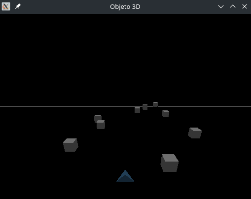

# Graficacion_A_Proyecto
This is a clone of a game called Cubefield.
Using C++ and libraries from OpenGL, I created a obstacle race game.

## Linux
Link main_Proyecto.cpp with glfw, glu and armadillo.

## Windows
Open the visual studio project; make sure to add the path to the .dlls

  

